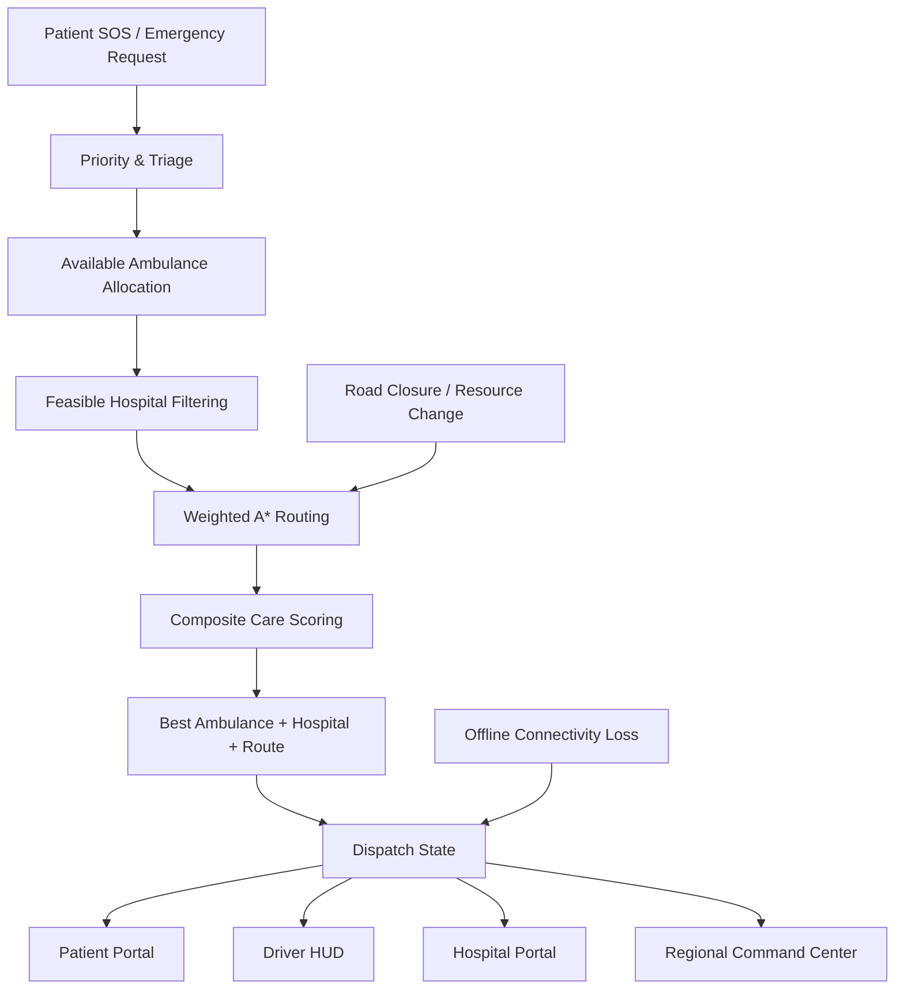

# 🚑 JeevaRaah

### Offline-First Emergency Routing & Healthcare Dispatch

> **The right care. The right route. In time.**

JeevaRaah is an offline-first emergency healthcare routing and dispatch platform designed for rural and peri-urban healthcare networks.

Instead of simply sending a patient to the **nearest hospital**, JeevaRaah evaluates the complete response:

**Patient → Available Ambulance → Feasible Route → Suitable Hospital → Required Care**

The system is demonstrated across a simulated **Dombivli–Kalyan–Thane–Navi Mumbai / MMR healthcare network** with a large-scale road graph of **50,000+ nodes and 200,000+ weighted edges**.

> **Core idea: Nearest is not always best. JeevaRaah optimizes for feasible care.**

---

## 🔗 Live Demo & Repository

- 🌐 **Live Demo:** https://neuronex.vercel.app
- 📂 **GitHub Repository:** https://github.com/ananyakalia14/NeuroNex
- 🔁 **Alternative Demo:** https://jeeva-raah.vercel.app

---

# 🎯 Why JeevaRaah?

Emergency routing becomes difficult when distance is only one part of the problem.

A nearby facility may have:
- no required specialist
- no suitable bed
- depleted critical medicine
- an inaccessible route
- no emergency capacity

At the same time:
- ambulances are limited
- emergencies arrive concurrently
- roads can become blocked
- connectivity can be unreliable

JeevaRaah therefore treats emergency response as a **constrained graph optimization problem**, not a simple nearest-hospital lookup.

### The decision pipeline

```text
Emergency Request
       ↓
Priority / Triage
       ↓
Available Ambulance Allocation
       ↓
Feasible Facility Filtering
       ↓
Weighted A* Routing
       ↓
Composite Care Scoring
       ↓
Best Ambulance + Route + Hospital
       ↓
Dispatch / Offline Queue
```

---

# 🧠 Core Algorithmic Approach

## 1. Emergency Priority Queue

Emergency requests are prioritized by urgency:

```text
P0 Critical
   ↓
P1 Urgent
   ↓
P2 Standard
```

For equal priority, earlier requests are processed first.

This allows the system to handle concurrent emergencies while treating the ambulance fleet as a shared, scarce resource.

---

## 2. Algorithmic Ambulance Allocation

JeevaRaah does not rely on a predetermined ambulance.

For an emergency request, the dispatch engine:

1. Reads currently available ambulances.
2. Filters occupied or infeasible resources.
3. Calculates road-network response cost from each available ambulance to the patient.
4. Selects the best feasible ambulance.
5. Updates that ambulance's dispatch state.
6. Continues with hospital/resource optimization.

```text
Available Ambulances
        ↓
Response Travel Time
        ↓
Feasible Ambulance Candidates
        ↓
Best Response Candidate
```

If no ambulance is available, the system does **not** fabricate a dispatch. The emergency remains queued and the emergency fallback pathway remains available.

---

# 3. Feasible Hospital Selection

JeevaRaah does not simply choose the geographically closest hospital.

Facilities are evaluated for feasibility based on the emergency's requirements.

Relevant constraints include:
- required specialist
- bed/capacity availability
- emergency capability
- medicine/resource availability
- route feasibility
- travel time
- current facility load

A facility lacking a required clinical capability can be excluded from the feasible candidate set before ranking.

---

# 4. Composite Multi-Objective Care Score

Among feasible facilities, JeevaRaah uses a weighted composite cost:

$$
C =
(\alpha \cdot T_{travel} \cdot \mu_{urgency})
+
(\beta \cdot T_{wait})
+
(\gamma \cdot P_{medicine})
+
(\delta \cdot P_{bed})
+
P_{specialty}
$$

### Default weights

| Parameter | Weight | Meaning |
|---|---:|---|
| α | 0.50 | Travel-time importance |
| β | 0.20 | Facility waiting/load penalty |
| γ | 0.15 | Medicine availability penalty |
| δ | 0.15 | Bed availability penalty |
| μ urgency | 1.0–1.5 | Urgency multiplier |

### Urgency multiplier

| Tier | Multiplier |
|---|---:|
| Critical | 1.5 |
| Urgent | 1.2 |
| Standard | 1.0 |

The weights can be tuned in the operations/admin environment for simulation and benchmarking.

---

# 5. Bed Availability Penalty

For the simulation:

$$
T_{wait} =
\begin{cases}
0 & \text{if bed ratio > 0.30}\\
30 & \text{if 0.10 < bed ratio ≤ 0.30}\\
60 & \text{if bed ratio ≤ 0.10}
\end{cases}
$$

Bed penalty:

$$
P_{bed} =
\begin{cases}
0 & \text{if available beds > 5}\\
40 & \text{if 1 ≤ available beds ≤ 5}\\
100 & \text{if available beds = 0}
\end{cases}
$$

---

# 6. Medicine Availability Penalty

For required emergency medicine:

$$
P_{medicine} =
\begin{cases}
0 & \text{if stock > 10}\\
50 & \text{if 1 ≤ stock ≤ 10}\\
100 & \text{if stock = 0}
\end{cases}
$$

This allows a slightly farther but clinically feasible facility to outrank a closer facility that cannot provide the required resource.

---

# 7. Weighted A* Pathfinding Engine

The routing engine is implemented using A* over a weighted healthcare road graph.

### Graph
- Adjacency-list representation
- Bidirectional weighted edges
- Dynamic travel weights
- Road blockage state

### Priority Queue

A custom binary Min-Heap provides:

$$O(\log N)$$

push/pop operations.

### Heuristic

The A* heuristic uses Haversine distance converted into estimated travel time:

$$
h(n)=
\frac{Haversine(n,target)}{30}
\times 60
$$

where 30 km/h is the simulation's default estimated average road speed.

### Haversine distance

$$
a =
\sin^2\left(\frac{\Delta\phi}{2}\right)
+
\cos(\phi_1)\cos(\phi_2)
\sin^2\left(\frac{\Delta\lambda}{2}\right)
$$

$$
d =
2R\arctan2(\sqrt a,\sqrt{1-a})
$$

where:

$$R=6371\text{ km}$$

---

# 8. Two-Leg Emergency Routing

A complete emergency response consists of two routing legs:

```text
Ambulance
    ↓
Patient
    ↓
Selected Hospital
```

### Leg 1 — Pickup

```text
Ambulance Current Location
        ↓
A*
        ↓
Patient
```

### Leg 2 — Care Route

```text
Patient
        ↓
A*
        ↓
Selected Hospital
```

The system can calculate:
- pickup distance
- pickup ETA
- patient-to-hospital distance
- patient-to-hospital ETA
- total response distance
- total response ETA

---

# 9. Dynamic Road Re-Routing

When an edge becomes blocked:

```text
Road Closure
     ↓
Edge marked blocked
     ↓
Existing route becomes invalid
     ↓
A* recalculates
     ↓
Alternative feasible route
     ↓
ETA / route updated
```

This supports simulation of:
- flooding
- landslides
- road closures
- traffic disruption

---

# 10. Large-Scale Graph & Performance Architecture

Target simulation scale:

- **50,000+ graph nodes**
- **200,000+ weighted road edges**
- thousands of healthcare/village points

A* executes in a dedicated Web Worker so pathfinding does not block the main UI thread.

With an adjacency-list graph and binary heap, the heap-based graph search is designed around:

$$
O((V+E)\log V)
$$

Actual runtime depends on graph topology, searched region, heuristic behavior and device hardware.

Graph and healthcare simulation data are persisted locally using IndexedDB/Dexie.

---

# 11. Spatial Indexing

A QuadTree is used for efficient geographic rendering and viewport queries.

```text
MAX_POINTS = 8
MAX_DEPTH  = 10
```

Only nodes relevant to the current viewport are dispatched to the renderer.

---

# 🏗️ System Architecture



---

# 🚨 Four Operational Portals

## 🆘 Patient SOS Portal

Designed around simplicity and low-literacy accessibility.

Features:
- one-tap emergency access
- visual emergency categories
- location detection
- multilingual interface
- Marathi / Hindi / English support
- emergency fallback
- response status

> **A person should be able to request help without understanding healthcare infrastructure or routing algorithms.**

## 🚑 Ambulance Driver HUD

Provides:
- assigned emergency
- route
- ETA
- distance
- mission status
- voice guidance
- response progression

Lifecycle:

```text
DISPATCHED
    ↓
EN_ROUTE
    ↓
ARRIVED
    ↓
COMPLETED
```

## 🏥 Hospital Emergency Ward Portal

Provides:
- incoming emergency information
- bed availability
- ICU/Oxygen/General capacity
- medicine inventory
- specialist availability
- diversion/facility status
- pre-arrival queue

## 🛡️ Regional Command Center

Provides:
- emergency queue
- ambulance fleet
- healthcare facilities
- road network
- blocked roads
- resource availability
- routing decisions
- decision telemetry
- simulation controls

---

# 🌐 Offline-First Architecture

Connectivity is treated as a constraint rather than an assumption.

Core routing data is available locally through IndexedDB/Dexie, and the routing engine can execute locally without requiring an online routing API.

When connectivity is unavailable:

```text
OFFLINE
   ↓
Local graph + cached simulation state
   ↓
Local routing
   ↓
Emergency stored as SYNC_PENDING
   ↓
Synchronize when connectivity returns
```

The system also provides an emergency fallback pathway through national emergency services.

> **Care should not stop simply because connectivity does.**

---

# 🗺️ Mapping

The application uses a realistic geographic map as the visualization layer while the healthcare network and routing graph are simulation data.

The map is **not the routing engine**.

The actual route is generated from JeevaRaah's graph/pathfinding layer.

Operational healthcare values such as bed capacity, medicine stock and ambulance availability are **simulation values**, not claims of live hospital inventory.

---

# 🧪 Testing & Verification

## Test 1 — Critical Cardiac Emergency

**Input**
- Location: Dombivli East / Manpada Road
- Emergency: Heart / Breathing
- Priority: P0 / Critical
- Required specialty: Cardiology

**Expected Result**

The system evaluates feasible facilities rather than blindly choosing the nearest hospital and selects a route/facility combination satisfying the emergency constraints.

**Status:** ✅ Passed

## Test 2 — Dynamic Road Blockage

**Input**

Block a major arterial connection during an active response.

**Expected Result**

The blocked edge becomes unavailable to A*, an alternate feasible route is calculated, and the response route/ETA updates.

**Status:** ✅ Passed

## Test 3 — Offline Emergency

**Input**

Disconnect the device/network and trigger an emergency.

**Expected Result**

Local graph/pathfinding remains available, the emergency is stored as `SYNC_PENDING`, and emergency fallback remains accessible.

**Status:** ✅ Passed

## Test 4 — Multilingual / Low-Literacy Accessibility

**Input**

Switch between English, Marathi and Hindi.

**Expected Result**

Emergency instructions and interface labels adapt to the selected language, with speech synthesis available where supported by the device/browser.

**Status:** ✅ Passed

## Test 5 — End-to-End Multi-Role Dispatch

```text
Patient SOS
    ↓
Dispatch created
    ↓
Ambulance receives mission
    ↓
Driver EN_ROUTE
    ↓
Hospital receives incoming case
    ↓
Hospital prepares resources
    ↓
Arrival
    ↓
Completion
```

**Status:** ✅ Passed

## Test 6 — No Available Ambulance

**Input:** All ambulances are occupied.

**Expected Result:** No fake ambulance is assigned. The emergency remains queued and the fallback pathway remains available.

**Status:** ✅ Implemented

## Test 7 — Hospital Capacity Failure

**Input:** A candidate hospital reaches zero available beds.

**Expected Result:** The facility becomes infeasible and another feasible candidate can be considered.

**Status:** ✅ Implemented

## Test 8 — Concurrent High-Priority Emergencies

**Input:** Multiple simultaneous P0/P1 emergencies with limited ambulances.

**Expected Result:** A global priority mechanism arbitrates the shared ambulance fleet, with P0 requests processed before lower-priority requests and earlier requests breaking equal-priority ties.

**Status:** ✅ Implemented

---

# 📊 What Makes JeevaRaah Different?

### Conventional routing

```text
Find nearest hospital
        ↓
Send ambulance
```

### JeevaRaah

```text
Emergency
   ↓
Priority
   ↓
Available ambulance
   ↓
Clinical requirements
   ↓
Hospital capacity
   ↓
Medicine availability
   ↓
Specialist availability
   ↓
Road feasibility
   ↓
A* route
   ↓
Best feasible care destination
```

# **Nearest ≠ Best**

JeevaRaah attempts to find the **best feasible response**, not merely the shortest geographic distance.

---

# 🔌 Third-Party APIs & Browser Technologies

| API / Technology | Purpose |
|---|---|
| **Google Maps JavaScript API / Geometry** | Geographic map visualization, markers and route display |
| **Web Geolocation API** | Captures device location for emergency localization |
| **Web Speech Synthesis API** | Multilingual speech feedback and hands-free guidance |
| **MapLibre GL / PMTiles** | Offline-capable/local vector-map architecture where available |

---

# 🤖 AI-Assisted Development

| Tool / Component | Purpose |
|---|---|
| **Google Gemini / Antigravity** | Assisted architecture exploration, implementation assistance, debugging and development iteration |
| **JeevaRaah Dispatch Engine** | Algorithmic multi-criteria decision system for ambulance/facility routing |
| **Rule-Based Emergency Triage** | Classifies emergency inputs into urgency tiers and required clinical capabilities |

> AI-assisted development does not replace the core routing algorithm. The judged routing, graph search, resource allocation and simulation logic are implemented as application code.

---

# 🛠️ Tech Stack

### Frontend
- React 19
- TypeScript
- Vite

### UI
- Vanilla CSS
- Lucide Icons
- Motion

### Data / Offline
- Dexie.js
- IndexedDB
- PWA / Workbox

### Algorithms
- A*
- Binary Min-Heap
- Priority Queue
- QuadTree
- Haversine distance
- Multi-criteria optimization
- Dynamic graph updates

### Concurrency / Performance
- Web Workers
- Local graph processing
- Viewport culling

### Maps
- Google Maps JavaScript API
- MapLibre GL
- PMTiles

---

# 📈 Complexity Summary

| Component | Approach | Complexity / Characteristic |
|---|---|---|
| Graph storage | Adjacency list | O(V + E) space |
| Priority queue | Binary Min-Heap | O(log N) push/pop |
| A* | Heap-based graph search | O((V + E) log V) worst-case framework |
| Road update | Edge-state mutation | O(1) state update |
| Spatial query | QuadTree | Sublinear viewport query in typical spatial distributions |
| Rendering | Viewport culling | Only visible nodes rendered |

---

# 🚀 Local Development

```bash
git clone https://github.com/ananyakalia14/NeuroNex.git
cd NeuroNex

npm install
npm run dev
```

Production build:

```bash
npm run build
```

---

# 🔐 Data & Simulation Disclaimer

JeevaRaah is a **hackathon / research prototype and simulation**.

Hospital identities and locations may be based on public/municipal directories, while operational values such as:

- bed availability
- medicine stock
- specialist availability
- ambulance availability
- route conditions

are simulation inputs unless explicitly connected to a live source.

The platform should therefore **not be interpreted as a live medical dispatch service or a source of real-time clinical capacity information**.

---

# 🏆 Submission Highlights

- ✅ Large-scale weighted graph routing
- ✅ A* with Binary Min-Heap
- ✅ Dynamic road blockage and re-routing
- ✅ Algorithmic ambulance allocation
- ✅ Priority-based emergency dispatch
- ✅ Multi-criteria hospital/resource matching
- ✅ Two-leg ambulance → patient → hospital routing
- ✅ Offline-first local graph processing
- ✅ Concurrent emergency handling
- ✅ Hospital capacity and medicine constraints
- ✅ Multilingual / low-literacy oriented UX
- ✅ Multi-role operational workflow
- ✅ Simulation telemetry
- ✅ 50,000+ graph-node architecture

---

# 👥 Team

## NeuroNex

### Product: JeevaRaah

> **The right care. The right route. In time.**

---

# 📄 License

MIT License — intended for healthcare, academic and humanitarian experimentation.
